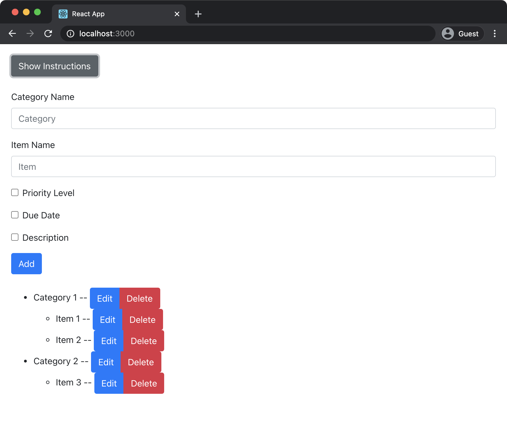

# List App

Assignment 3 for SFWRENG 4HC3 - Human Computer Interfaces

## Overview

The goal was to create a simple list app. This app allows you to create a list of categories with each category having their own sub-list. Any item can be edited or deleted at any time. Each item in a sub-list can have a priority level (none, low, medium, high), due date, and/or a description.

    

## How To Run

1. `npm install`
2. `npm start`
3. Open `http://localhost:3000/` in a browser

_Note: Run with Docker by running `docker compose up`_

## Technologies Used

- React
